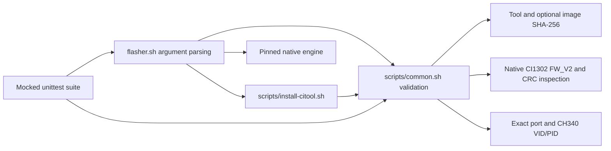

# Component diagram

```mermaid
flowchart LR
    CLI[flasher.sh argument parsing] --> Common[scripts/common.sh validation]
    CLI --> Installer[scripts/install-citool.sh]
    Installer --> Common
    Common --> Digests[Tool and optional image SHA-256]
    Common --> Format[Native CI1302 FW_V2 and CRC inspection]
    Common --> Identity[Exact port and CH340 VID/PID]
    CLI --> Engine[Pinned native engine]
    Tests[Mocked unittest suite] --> CLI
    Tests --> Common
```
