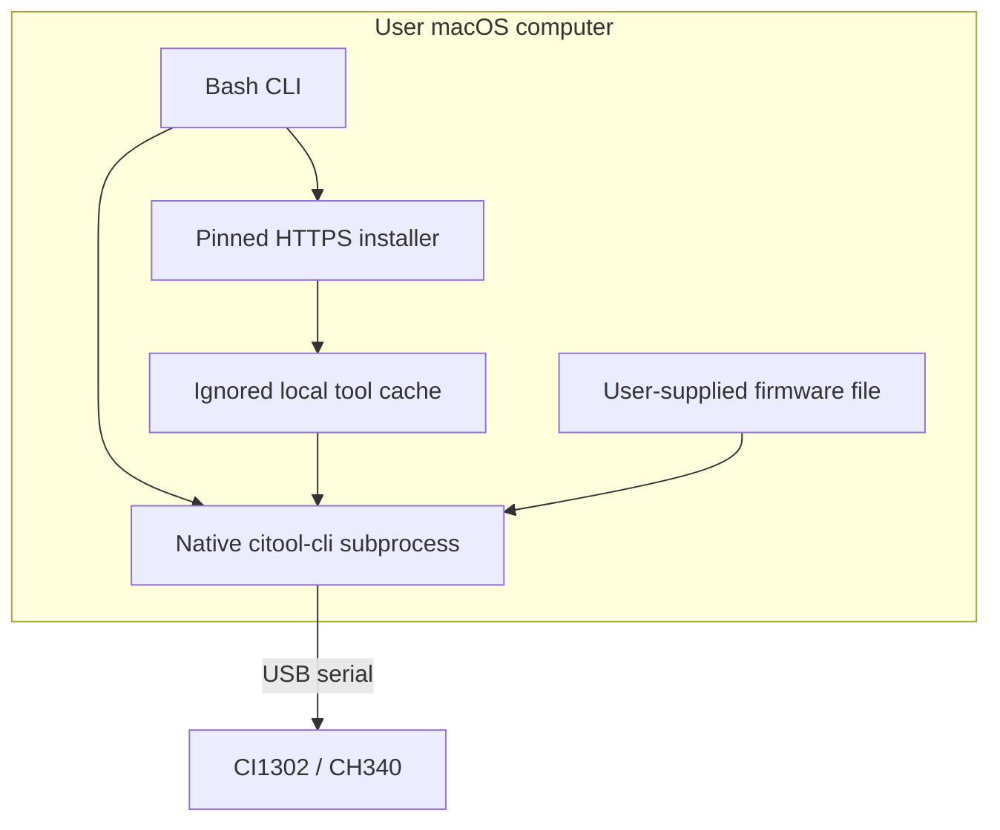

# Container diagram

Here, containers mean application boundaries; no Docker/Podman container runs.

```mermaid
flowchart TB
    subgraph Mac[User macOS computer]
        CLI[Bash CLI]
        Installer[Pinned HTTPS installer]
        Engine[Native citool-cli subprocess]
        Cache[Ignored local tool cache]
        Image[User-supplied firmware file]
        CLI --> Installer
        Installer --> Cache
        CLI --> Engine
        Cache --> Engine
        Image --> Engine
    end
    Engine -->|USB serial| Module[CI1302 / CH340]
```
