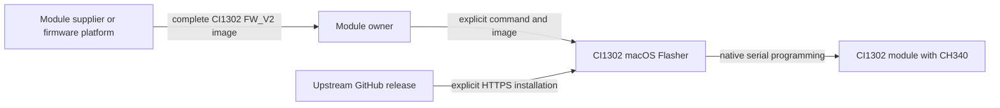

# Context diagram

```mermaid
flowchart LR
    User[Module owner] -->|explicit command and image| Helper[CI1302 macOS Flasher]
    Supplier[Module supplier or firmware platform] -->|complete CI1302 FW_V2 image| User
    GitHub[Upstream GitHub release] -->|explicit HTTPS installation| Helper
    Helper -->|native serial programming| Module[CI1302 module with CH340]
```

The helper does not generate the firmware, contact SmartPI, or configure the
host controller. The user remains responsible for compatible firmware/hardware.
