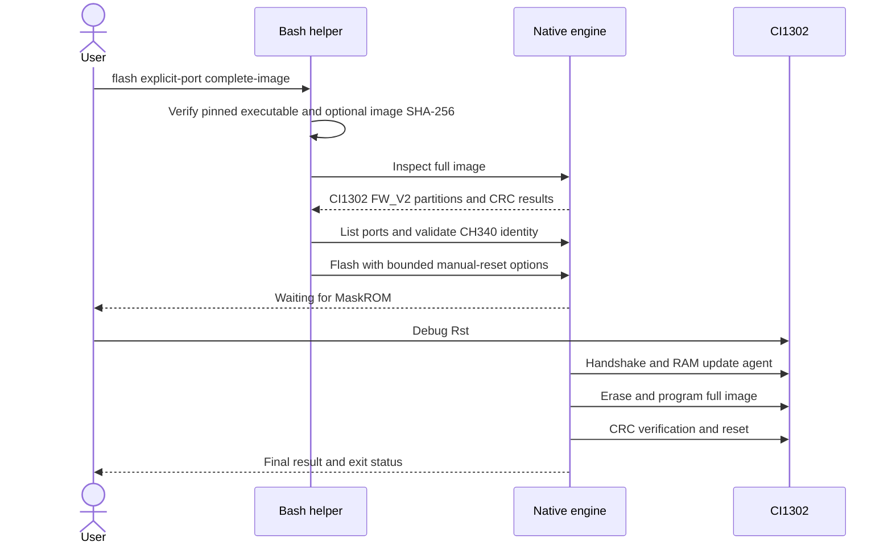

# Programming data flow

An inspection or identity failure stops before serial programming. Probe uses
the handshake/RAM-agent subset and does not erase/write Flash. Firmware files
and progress logs belong to the user; they are not uploaded by the helper.
