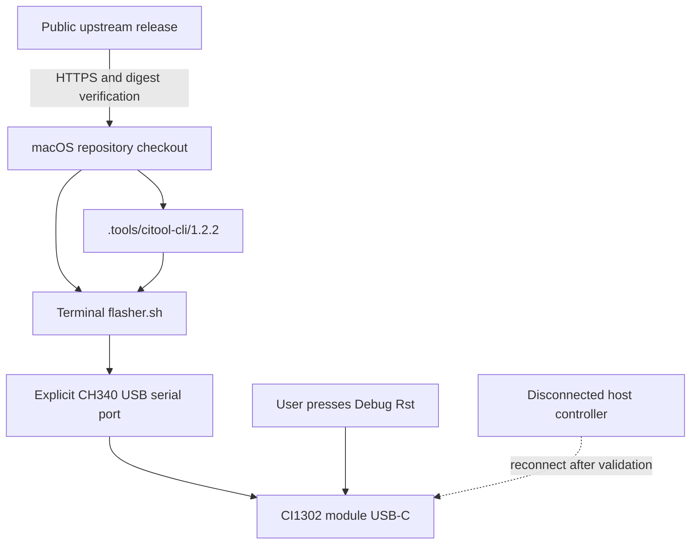

# Deployment diagram

```mermaid
flowchart TB
    Release[Public upstream release] -->|HTTPS and digest verification| Checkout[macOS repository checkout]
    Checkout --> Cache[.tools/citool-cli/1.2.2]
    Checkout --> CLI[Terminal flasher.sh]
    Cache --> CLI
    CLI --> USB[Explicit CH340 USB serial port]
    USB --> CI[CI1302 module USB-C]
    Reset[User presses Debug Rst] --> CI
    Host[Disconnected host controller] -. reconnect after validation .-> CI
```

No privileged service, container, network listener, or automatic scheduled job
is installed. Serial access is obtained through the user's host permissions.
